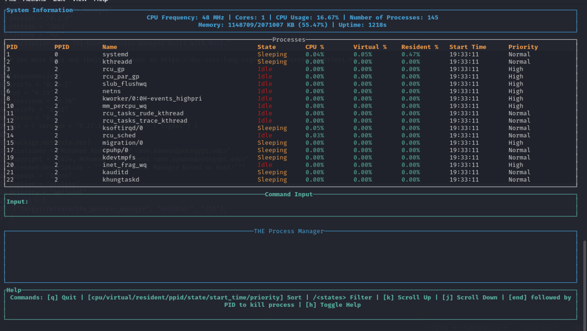

# ⚙️ **THE Process Manager**

A 🦀 **Rust-based** TUI 💻 application that monitors and displays detailed 📊 process metrics. This 🛠️ tool retrieves 🧠 **CPU** and 💾 **memory usage** data for processes running on the system.

### ✍️ **Authors**
- Abdelrahman Elaskary
- Malak Zeerban
- Mohamed Abdel-Hamid
- Merna Elsaaran

## ✨ **Features**
1. **📊 Retrieve and Display Process Data**: 📂 Reads process information from the filesystem using the 
2. **🧠 CPU and 💾 Memory Usage Calculations**: 📊 Calculates and displays 🧠 CPU and 💾 memory usage as a percentage of total available resources.
3. **🔄 Sorting**: 📋 Sort processes
4. **🔍 Detailed Process Information**: 📝 Provides detailed information for individual processes based on their PID.
   
# 🏗️ Project Structure

The project is organized into several key 🗝️ modules, each responsible for different aspects of the 🖥️ application:

- **🛠️ Application Setup**:
  - `app.rs`: 🖐️ Handles the core ⚙️ functionality and running of the application, including initializing and configuring necessary settings.
  - `main.rs`: 🚀 Serves as the entry point for the application, initiating the main execution flow.

- **📊 Process Handling**:
  - `process/data.rs`: 📈 Manages data related to system processes, such as collecting and calculating relevant metrics.
  - `process/display.rs`: 🖼️ Provides functionality for displaying detailed information about individual processes.

- **🖥️ Terminal User Interface (TUI)**:
  - `tui/render.rs`: 🎨 Responsible for rendering the visual layout of the TUI, including tables, system information, and user input sections.
  - `tui/mod.rs`: 🛠️ Sets up and manages the TUI, including initializing components and handling events.

---

## 📋 **Prerequisites**
- **🦀 Rust**: Ensure you have Rust installed on your 🖥️ machine.
- **🐧 Linux**: This tool relies on the `/proc` filesystem, which is available on Linux-based systems.

